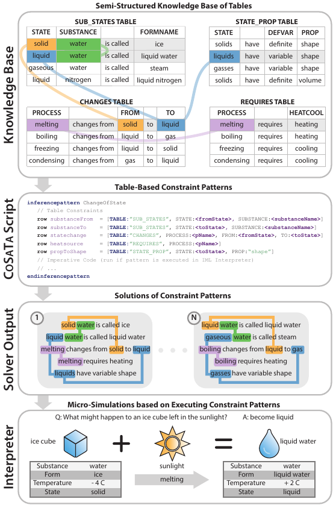
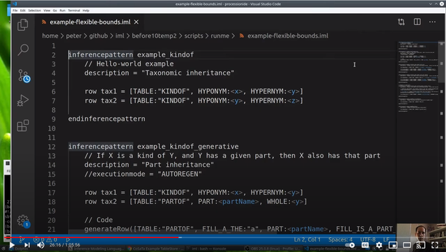
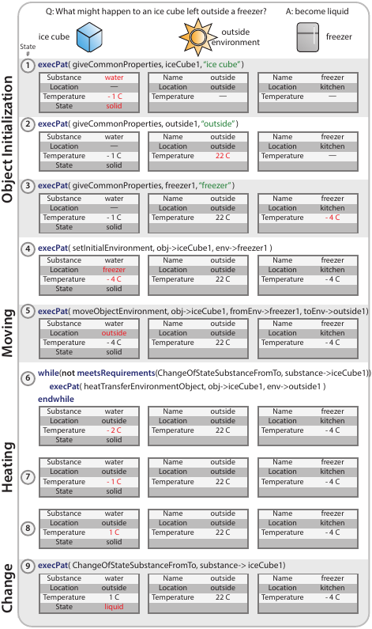

---
**CoSaTa / IML**: A Constraint Satisfaction Solver and Interpreted Language for Semi-Structured Tables of Sentences
---

This is the repository for the EMNLP 2020 paper: [CoSaTa: A Constraint Satisfaction Solver and Interpreted Language for Semi-Structured Tables of Sentences](https://aclanthology.org/2020.emnlp-demos.10.pdf)

### YouTube Introduction
Probably the easiest way to get introduced to CoSaTa is through the system demonstration video on YouTube.  It includes a high-level overview (~25 minutes), followed by a system demonstration (~35 minutes): 

[](https://youtu.be/t93Acsz7LyE)

System Demonstration Video: [https://youtu.be/t93Acsz7LyE](https://youtu.be/t93Acsz7LyE)

## Introduction
CoSaTa is a prototype language for performing inference over semi-structured tables of text.  It has two main components: 
- **Solver:** A stand-alone constraint satisfaction solver that operates over text (TSV) tables, expressed in a simple scripting language.  The results are output in JSON (for incorporating into your e.g. python software) and HTML (for viewing/debugging).  
- **Language:** A prototype hybrid imperative-declarative language (coupled with a knowledge base of tables) that essentially allows the rules of a world model to be expressed as declarative constraint satisfaction patterns (that operate over the knowledge expressed in the tables), while having the /results/ expressable in simple imperative patterns.  

Unless you are interested in prototype languages, most folks will likely be interested in CoSaTa for the stand-alone constraint satisfaction solver. 

CoSaTa is written in Scala 2.11 and requires Java 1.8+.  It has been tested on Ubuntu 20.04 LTS. 


# Installation
Assuming Java 1.8+ is installed on your Ubuntu distribution:

Step 1: Install SBT (Scala Build Tool)
[SBT Installation Instructions](https://www.scala-sbt.org/download.html)

Step 2: Clone the repository:
```
git clone https://github.com/clulab/cosata/
```

Step 3: That's it.  You can verify the installation by running one of the example run scripts: 
```
cd cosata
./runme-enumerate-simple.sh
```

# Getting Started -- Running the constraint satisfaction solver

Running the constraint satisfaction solver requires a number of preconditions: 
- **TableStore:** You have an existing store of tables (tablestore), in tab-delimited (TSV) format.  Some additional formatting constraints are required -- see the TableStore format section.  The WorldTree V2 tablestore is included in this repository: [annotation/expl-tablestore-export-2020-02-17-123232/tables](annotation/expl-tablestore-export-2020-02-17-123232/tables)
- **Constraint Patterns:** You have authored one or more constraint satisfaction patterns in the IML scripting format.  These are saved in one or more .IML files in a single directory.  Here's an example with a few short constraint patterns that runs fairly quickly: [examples/enumeration/worldtree/examples1.iml](examples/enumeration/worldtree/examples1.iml)
- **Properties file:** A properties file that describes where the input and output directories are, and some basic parameters (e.g. maximum number of threads, maximum number of matches, etc.).  See this example properties file: [props-release/worldtree-simple/enumeratePatternsToJSON1.props](props-release/worldtree-simple/enumeratePatternsToJSON1.props)

As output, the solver will run those constraint satisfaction patterns against the tablestore, and output the following: 
- **JSON Solutions:** A list of solutions in JSON format, that you can easily import into your own software.  Here's an example: [output/enumeration/worldtree/examples1.iml.json](output/enumeration/worldtree/examples1.iml.json)
- **HTML Solutions:** The solutions in an easily-viewable, clickable format, for visualization/debugging.  Here's an example: [output/enumeration/worldtree/examples1.iml.infpat.html](output/enumeration/worldtree/examples1.iml.infpat.html)
- **HTML Tablestore:** An HTML rendering of the TableStore, as the solver sees it, as passed through the tokenizer/lemmatizer/filtering/etc, useful for debugging.  Here's an example: [output/enumeration/worldtree/tablestore.html](output/enumeration/worldtree/tablestore.html)
 
This distribution includes output of the examples.  If you'd like to run the constraint satisfaction solver yourself, or run it on your own data, the command is (*runme-enumerate-simple.sh*) : 
```
sbt "runMain inferenceengine.util.EnumeratePatternsToJSON -props props-release/worldtree-simple/enumeratePatternsToJSON1.props"
```

# Inference Pattern Output

The pre-generated output solutions of the ~400 automatic + manual science-themed inference patterns (Section 4 of the paper) is included here: [output/worldtree-v2/outputAutomaticPlusManual](output/worldtree-v2/outputAutomaticPlusManual/) .  This output includes the JSON (to incorporate into your system, without having to run the solver), as well as the HTML visualizations.

The command to regenerate these is in *runme-enumerate-infpat.sh*: 
```
sbt "runMain inferenceengine.util.EnumeratePatternsToJSON -props props-release/worldtree-infpatterns/enumeratePatternsToJSON.props"
```

# Interpreter Output/Examples


For the ice melting simulation example used in the paper: 
- **Control Script:** The example control script to run this is in: [before10temp2/scripts/ice-cube-example.iml](before10temp2/scripts/ice-cube-example.iml)
- **Inference Patterns:** The various science-themed inference patterns to run this are in: [before10temp2/scripts](before10temp2/scripts)
- **Output:** The output of the interpreter is here: [output/ice-cube-example](output/ice-cube-example) . The "state space" output is an HTML version of Figure 3 in the paper. 
- **Running it:** Please see [runme-icecube.sh](runme-icecube.sh) .


# Tablestore format
The Tablestore uses tab delimited (TSV) files.  
- The files should be tab delimited, in a folder marked /tables/
- A separate index file that lists all the tables should be included in the root (e.g. tableindex.txt)
- The final column of each valid table should be titled '[SKIP] UID', and contain a globally unique string identifier for each table row.  This is how the solver references each table row during solving/output/etc. 
- The first line in each table is the header (column name).  The column names should be unique within a table.  
- Tables can also optionally have /two/ header lines: one that's long/human readable, and one that's a shortform for reference in the IML scripts.  If this is the case, just make sure the 'two row table header' options are set. 

An example valid tablestore can be found in: [annotation/expl-minitablestore-current](annotation/expl-minitablestore-current)


# Frequently Asked Questions (FAQ)
**Q: Constraint satisfaction problems can be famously intractable.  How fast does this run?**

A:  The solver has been moderately optimized, and runs fairly quickly.  There are still plenty of optimizations possible, but it generally runs within the limits of patience.  For example, on a 16-core (32-thread) processor, the ~400 constraint patterns in Section 4 in the paper enumerate solutions in about 30 minutes. 

**Q: The solver seems to be taking a long time to produce solutions to a problem?**

A: Depending on the size of your knowledge base, and how many possible solutions your pattern might have, this can happen.  In general, adding more lexical constraints to specific rows (that allows it to pre-filter a given table down to a small set of candidate rows) helps reduce the complexity of the problem a great deal.  One can also set hard runtime limits, so the solver times out on difficult problems.  The solver was also only tested on the WorldTree tablestore (80 tables, ~10k rows total) -- if you're using it on something much larger, it may take longer.  To a first approximation (pre-filtering), solution time should scale (approximately) with the number of rows in the tables referenced in a given constraint satisfaction pattern. 

**Q: Only (say) 10,000 solutions are enumerating, but I know there are more?**

A: For tractibility, the solver only generates and outputs a maximum of N solutions per constraint satisfaction patterns.  This can be set in the properties file.

**Q: How is the solver parallelized?**

A: While a number of aspects of the solving algorithm are wrapped in parallel structures, the largest benefit is from parallelizing solving across different patterns.  That means if you have an IML file with 100 different constraint patterns, each one will run in a separate thread (up to the maximum number of threads).

**Q: The solver appears to freeze with a large number of threads?**

A: I have noticed that a large number of threads will sometimes freeze in the console, but not when running through IntelliJ.  This is likely due to the volume of verbose output generated.  A fix is likely to reduce the number of threads, or run through IntelliJ. 

**Q: Is the IDE available?**

A: The IDE is written in Electron, and uses the Monaco editor for code editing (the same editor as Visual Studio Code).  Unfortunately the libraries moved faster than the project, and the code now uses legacy versions of the libraries and is difficult to compile.  The code for the IDE is available in this github repo: ... 

**Q: Is the language being actively developed?** 

A: Yes and no -- I'm actively using the solver.  The concept behind the interpreted language is awesome, and I'm actively working on languages for world modeling -- but it's also clear that coding/debugging in a language that's coupled to a knowledge base is very challenging, and places a lot of load on tooling to check for consistency, debugging, etc.  It's also very difficult (as one individual) to maintain a language and tool suite with technologies (e.g. IDE libraries) that rapidly change.  So as a prototype language it was very successful -- but clearly exposes the pain points for writing knowledge-centered scripting languages for small world modeling.  If you're interested in this, please get in touch. 

# Contact
CoSaTa was written by Peter Jansen (pajansen@email.arizona.edu).  For questions, issues, bug reports, or feature requests, please start a github issue. 

# Paper/Citation

The EMNLP 2020 paper is available [here](https://aclanthology.org/2020.emnlp-demos.10/) from the ACL Anthology. 

```
@inproceedings{jansen-2020-cosata,
    title = "{C}o{S}a{T}a: A Constraint Satisfaction Solver and Interpreted Language for Semi-Structured Tables of Sentences",
    author = "Jansen, Peter",
    booktitle = "Proceedings of the 2020 Conference on Empirical Methods in Natural Language Processing: System Demonstrations",
    year = "2020",
    publisher = "Association for Computational Linguistics",
    url = "https://aclanthology.org/2020.emnlp-demos.10",
    doi = "10.18653/v1/2020.emnlp-demos.10",
    pages = "70--76",
}
```

# License
Copyright 2020 Peter Jansen

   Licensed under the Apache License, Version 2.0 (the "License");
   you may not use this file except in compliance with the License.
   You may obtain a copy of the License at

       http://www.apache.org/licenses/LICENSE-2.0

   Unless required by applicable law or agreed to in writing, software
   distributed under the License is distributed on an "AS IS" BASIS,
   WITHOUT WARRANTIES OR CONDITIONS OF ANY KIND, either express or implied.
   See the License for the specific language governing permissions and
   limitations under the License.
